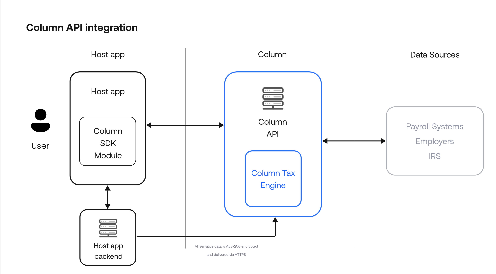

# Column Module Sample React Native app

See the full documentation here: https://docs.columntax.com/

## Column Tax Architecture

Column is a mobile SDK that can be added to any mobile finance app that adds user-facing tax features. The integration 
of a customer application will have the following relationship.
1. A customer will receive a client id and secret key Column Tax
2. A customer's backend application will authenticate an end-user with Column Tax's backend application to retrieve a user token
3. The customer's backend passes this token to their frontend application
4. The customer's frontend application opens Column's SDK with the token.




## Sample Backend Application
The `server` directory contains a lightweight javascript backend that mimics an example customer 
backend. The application includes an endpoint,`/token`, for creating a mock user on Column Tax's sandbox API and 
returning the user token.

### Starting The Sample Backend
Requirements:
- Update these values in `app.js` with your Column Tax client id and secret key
```javascript
const clientId = '<client_id>'
const clientSecret = '<client_secret>'
```
Start Server:
```shell
cd server
yarn
node app.js
```

## Sample React Native Application
The `sample-app` directory contains a sample React Native application that opens the Column Tax SDK. This application
will first request a user token from the sample backend which it will then pass to Column's SDK.

### Starting The Sample React Native Application
Requirements:
- Install the expo cli: https://docs.expo.dev/get-started/installation/

Start React Native App:
```shell
cd sample-app
yarn
expo start
```